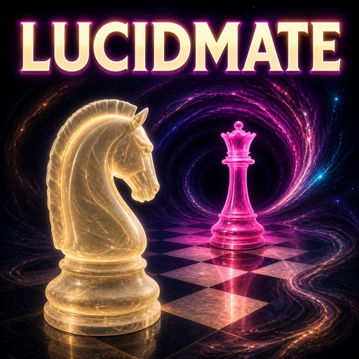
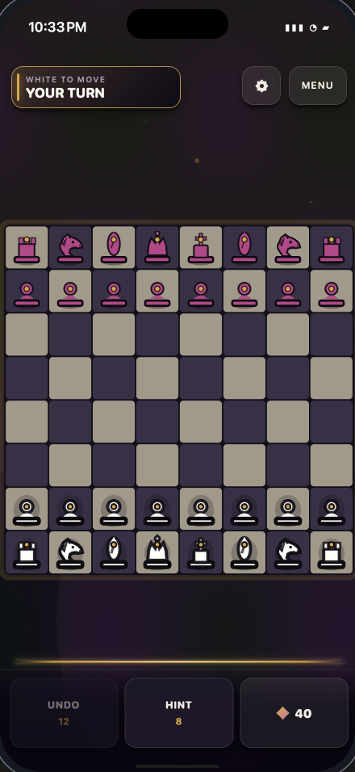

# LUCIDMATE

<p align="center">
  
</p>

Psychedelic chess for solo play, live rivals, and relaxed games with friends on [RUN.world](https://run.world).

<p align="center">
  
</p>

## What is inside

- Complete standard chess: castling, en passant, promotion, checkmate, stalemate, and the 50-move draw.
- Solo play against Easy, Standard, or Expert AI; local pass-and-play; live matchmaking; persistent friend boards.
- A clear match inbox, invite codes, turn deadlines, safe chess reactions, rematches, rivals, and weekly leagues.
- Auras, mastery ranks, daily rewards, daily quests, streaks, and six cosmetic board themes.
- Procedural pieces, living shader backdrops, particles, generated audio, reduced motion, and optional haptics.
- Opt-in return reminders for daily rewards and correspondence turns.

## Fair economy

Auras are earned through play and spent on hints, undos, and earnable themes. Purchases never change chess rules, move legality, or AI strength. The RUN catalog offers permanent cosmetics and an ad-free option; rewarded ads are optional, and interstitials are capped to natural breaks.

## Local development

Requires Node.js 22 or newer.

```bash
npm install --cache /tmp/npm-lucidmate
npm run dev
```

For two-client multiplayer without multiple RUN accounts:

```bash
npm run dev:multiplayer
```

Open two private browser windows, create a friend board in one, then enter its six-character code in the other. This uses the local authoritative room server; real RUN identity, notifications, ads, and purchases still require the host.

## Verification

```bash
npm run check
```

Focused commands: `npm run typecheck`, `npm run simulate`, `npm run visual-qa`, and `npm run build:multiplayer`.

## Stack

React 19 · PixiJS 8 · WebGPU-first with WebGL fallback · Vite 6 · TypeScript · RUN SDK 5.24

Design details live in [DESIGN.md](DESIGN.md). Security reports follow [SECURITY.md](SECURITY.md).

## License

See [LICENSE.md](LICENSE.md).
